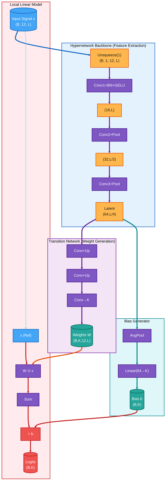

<p align="center">
  
  
  
</p>

# ECG-IMN: Interpretable Mesomorphic Neural Networks for 12-Lead Electrocardiogram Interpretation

## Abstract

Deep learning has achieved expert-level performance in automated electrocardiogram (ECG) diagnosis, yet the "black-box" nature of these models hinders their clinical deployment. Trust in medical AI requires not just high accuracy but also transparency regarding the specific physiological features driving predictions. Existing explainability methods for ECGs typically rely on post-hoc approximations (e.g., Grad-CAM and SHAP), which can be unstable, computationally expensive, and unfaithful to the model's actual decision-making process. **In this work, we propose the ECG-IMN, an Interpretable Mesomorphic Neural Network tailored for high-resolution 12-lead ECG classification.** Unlike standard classifiers, the ECG-IMN functions as a hypernetwork: a deep convolutional backbone generates the parameters of a strictly linear model specific to each input sample. This architecture enforces intrinsic interpretability, as the decision logic is mathematically transparent and the generated weights $\mathbf{W}$ serve as exact, high-resolution feature attribution maps. We introduce a transition decoder that effectively maps latent features to sample-wise weights, enabling precise localization of pathological evidence (e.g., ST-elevation, T-wave inversion) in both time and lead dimensions. **We evaluate our approach on the PTB-XL dataset for Myocardial Infarction detection**, demonstrating that the ECG-IMN achieves competitive predictive performance (AUROC comparable to black-box baselines) while providing faithful, instance-specific explanations. By explicitly decoupling parameter generation from prediction execution, our framework bridges the gap between deep learning capability and clinical trustworthiness, offering a principled path toward "white-box" cardiac diagnostics.

## Quickstart: PTB-XL NORM vs X (Train / Inference / Plots)

This project provides **Interpretable Mesomorphic Networks (IMN)** and a **2D CNN + Grad-CAM baseline** for binary ECG classification (NORM vs MI, STTC, CD, HYP) on PTB-XL. All scripts run from the project root.

### Model families

| Model | Description | Train script | Inference script |
|-------|-------------|--------------|------------------|
| **Baseline 2D CNN + Grad-CAM** | Post-hoc Grad-CAM explanations | `scripts/train_baseline_2d_gradcam.sh` | `scripts/infer_baseline_2d_gradcam.sh` |
| **IMN v1 (simple)** | Basic IMN, 500 Hz | `scripts/train_imn_v1.sh` | `scripts/infer_imn_v1.sh` |
| **IMN v2 (transition, 2-class CE)** | Transition net, 100 Hz | `scripts/train_imn_v2_ce.sh` | `scripts/infer_imn_v2_ce.sh` |
| **IMN v2 (transition, single linear)** | BCE, 100 & 500 Hz | `scripts/train_imn_v2_one_linear.sh` | `scripts/infer_imn_v2_one_linear.sh` |

### Model Architecture

The IMN uses a **hypernetwork-generated local linear model** for ECG classification. The hypernetwork extracts latent features and generates **instance-specific weights and biases**, which are then applied to the original ECG signal.



### Pre-trained checkpoints & demo

[](https://huggingface.co/SEARCH-IHI/mesomorphicECG) [**Model on Hugging Face**](https://huggingface.co/SEARCH-IHI/mesomorphicECG)

[](https://huggingface.co/spaces/SEARCH-IHI/mesomorphicECG_XAI)

An interactive XAI demo is available as a Hugging Face Space: [**MesomorphicECG XAI**](https://huggingface.co/spaces/SEARCH-IHI/mesomorphicECG_XAI).

Pre-trained IMN checkpoints are available on [Hugging Face](https://huggingface.co/SEARCH-IHI/mesomorphicECG). Download a checkpoint and pass it to the inference scripts via `--ckpt`, or place it in the expected run directory so the inference scripts auto-detect it.

**Repo structure:**
- **Categorical IMN** (2-class CE): `categorical_imn_100hz/<task>/`, `categorical_imn_500hz/<task>/`
- **Single-Linear IMN**: `single_linear_imn_100hz/<task>/`, `single_linear_imn_500hz/<task>/`

Where `<task>` is one of: `norm_vs_cd`, `norm_vs_hyp`, `norm_vs_mi`, `norm_vs_sttc`.

**Example (Python):**
```python
from huggingface_hub import hf_hub_download

ckpt_path = hf_hub_download(
    repo_id="SEARCH-IHI/mesomorphicECG",
    filename="categorical_imn_500hz/norm_vs_mi/best-imn-epoch=18-val_auc=0.9555.ckpt",
)
```

**Example (CLI):** Run inference with a downloaded checkpoint:
```bash
python models/imn_v2_transition_ce.py --inference_only --ckpt /path/to/best-imn-epoch=18-val_auc=0.9555.ckpt \
  --path /path/to/ptb-xl --task norm_vs_mi --sampling_rate 500
```

### Training

Run from the project root (`cd /work/vajira/DL2025/mesormorphic_ecg`):

```bash
# Baseline Grad-CAM (all tasks @ 100 Hz)
bash scripts/train_baseline_2d_gradcam.sh

# IMN v1 (simple, 500 Hz)
bash scripts/train_imn_v1.sh

# IMN v2 transition (2-class CE, 100 Hz)
bash scripts/train_imn_v2_ce.sh

# IMN v2 single linear (100 & 500 Hz)
bash scripts/train_imn_v2_one_linear.sh

# IMN v2 single linear with ECG+IMN heatmap plots (quick test: epochs=1)
bash scripts/train_imn_v2_one_linear_ecgplots.sh
```

### Inference

Inference scripts auto-detect the latest checkpoint per task and produce validation metrics + PDF visualizations. Optional args: `[window] [stride] [leads] [heatmap_height] [ecg_height]` (and `viz_ecg_plot` for baseline).

```bash
# Baseline Grad-CAM
bash scripts/infer_baseline_2d_gradcam.sh
bash scripts/infer_baseline_2d_gradcam.sh 125 67 "I,V2,V3" 0.3 0.3 1   # with ECG plot

# IMN v1
bash scripts/infer_imn_v1.sh

# IMN v2 CE
bash scripts/infer_imn_v2_ce.sh
bash scripts/infer_imn_v2_ce.sh 2 10 "V1,V2,V3" 0.3 0.3

# IMN v2 single linear
bash scripts/infer_imn_v2_one_linear.sh 125 67

# IMN v2 single linear with ECG+heatmap layout
bash scripts/infer_imn_v2_one_linear_ecgplots.sh 125 67 "I,V2,V3" 0.3 0.3
```

### Output layout

- **Baseline Grad-CAM**: `runs/baseline_2d_gradcam_100Hz/{task}/{timestamp}/`
- **IMN v1**: `runs/imn_ecg_simple_implementation_GM_Basic/{task}/{timestamp}/`
- **IMN v2 CE**: `runs/imn_ecg_transition_net_GM_100Hz/{task}/{timestamp}/`
- **IMN v2 single linear**: `runs/imn_ecg_transition_net_GM_one_linear_{100,500}Hz/{task}/{timestamp}/`

### Authors

- [Vajira Thambawita](https://orcid.org/0000-0001-6026-0929)<sup>1</sup>
- [Jonas L. Isaksen](https://orcid.org/0000-0003-3227-1131)<sup>2</sup>
- [Jørgen K. Kanters](https://orcid.org/0000-0002-3267-4910)<sup>2</sup>
- [Hugo L. Hammer](https://orcid.org/0000-0001-9429-7148)<sup>3</sup>
- [Pål Halvorsen](https://orcid.org/0000-0003-2073-7029)<sup>1</sup>

<sup>1</sup> SimulaMet, Oslo, Norway — <sup>2</sup> University of Copenhagen, Copenhagen, Denmark — <sup>3</sup> Oslo Metropolitan University, Oslo, Norway

### Citation

If you use this code or models in your research, please cite:

**Paper Title**
```bibtex
@inproceedings{imnecg,
  title={paper title},
  booktitle={xxxx},
  year={2026},
}
```


