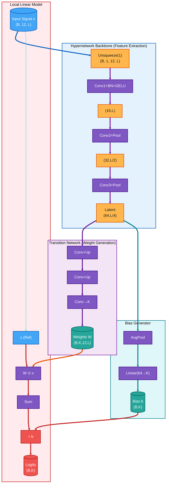

# Hypernetwork-Driven Local Linear ECG Model

This document visualizes the **hypernetwork-generated local linear model** used for ECG classification.
The hypernetwork extracts latent features and generates **instance-specific weights and biases**, which are then applied to the original ECG signal.

---

## 🧠 Model Architecture

